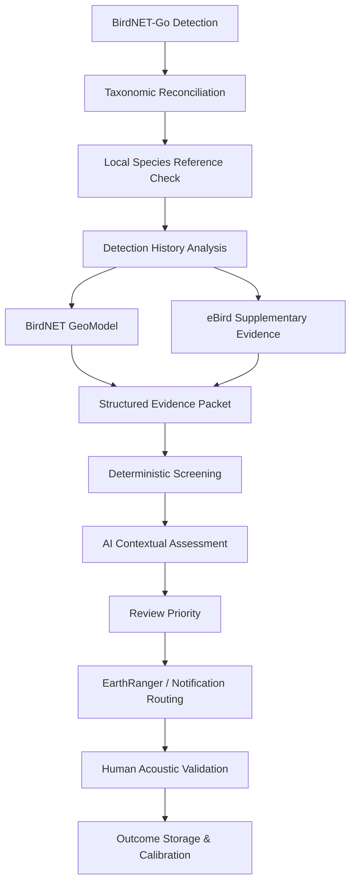

# BirdNET Detection Screening

> **Evidence-based screening and human-in-the-loop validation of unusual BirdNET detections.**

This project develops a reproducible workflow for prioritising BirdNET-Go detections using **taxonomic reconciliation, local species references, detection history, spatiotemporal evidence, and AI-assisted contextual assessment**.

The framework is being developed for bird monitoring on **Cempedak and Nikoi Islands**, with the longer-term aim of supporting an operational screening layer between **BirdNET-Go** and **EarthRanger**.

---

## At a Glance

| Component | Role |
|---|---|
| **BirdNET-Go** | Produces acoustic species detections |
| **Taxonomy** | Resolves naming and species-identity mismatches |
| **Local reference** | Checks whether a taxon is currently documented on Cempedak and Nikoi |
| **Detection history** | Measures repetition across time and stations |
| **GeoModel** | Provides geographic and seasonal context |
| **eBird** | Adds supplementary occurrence evidence |
| **Rule-based screening** | Generates reproducible evidence flags |
| **AI assessment** | Interprets combined or conflicting evidence |
| **Human review** | Provides final biological validation |

---

## Core Principle

> **Taxonomy establishes identity.**  
> **Data establish evidence.**  
> **Rules establish reproducible signals.**  
> **AI interprets context.**  
> **Humans establish biological truth.**

The system is designed to answer:

> **Does this detection deserve human attention?**

It is **not** designed to automatically determine whether a species is definitively present or absent.

---

## Proposed Workflow



---

## What the Framework Is Designed to Do

The pipeline aims to:

- identify unusual detections that warrant investigation;
- distinguish **potential new local records** from already documented taxa;
- minimise false novelty flags caused by taxonomy or naming mismatches;
- combine local, temporal, geographic, and external occurrence evidence;
- prioritise detections for acoustic review;
- use AI as a **contextual triage layer rather than a final species validator**; and
- retain human validation outcomes for later evaluation and calibration.

---

## Important Interpretation Rules

### A BirdNET detection is not a confirmed species record

BirdNET-Go provides an acoustic classification.

A detection may later be:

```text
confirmed
rejected
unresolved
```

Final biological validation remains dependent on human review.

### `Not listed` does not mean `absent`

If a taxonomically reconciled species is not found in the supplied Cempedak and Nikoi fauna reference, the system records:

```text
not_listed_in_current_local_reference
```

This means only that the taxon is not present in the current supplied reference.

It does **not** automatically mean that the species is biologically absent from the island.

### Confidence is supporting evidence

BirdNET confidence is retained as a model output and interpreted alongside other evidence.

It is **not** treated as the probability that the species is biologically present.

---

## Review Categories

The screening process produces one of four operational categories:

| Category | Meaning |
|---|---|
| **Routine** | No major anomaly currently requires additional attention |
| **Review** | Further human investigation is warranted |
| **Priority Review** | Unusual, potentially significant, or conflicting evidence requires prompt review |
| **Data Issue** | Reliable screening cannot continue because important information is unresolved |

These categories represent **review priority**, not species correctness.

A `Priority Review` may ultimately be confirmed, rejected, or remain unresolved.

---

## Project Architecture

```text
src/
├── ingestion/          # BirdNET detection input
├── taxonomy/           # Name and taxonomy reconciliation
├── local_reference/    # Cempedak / Nikoi reference lookup
├── evidence/           # Detection history, GeoModel, eBird
├── screening/          # Deterministic screening logic
├── ai/                 # Contextual AI assessment
├── routing/            # EarthRanger / notification integration
└── validation/         # Human outcomes and feedback
```

---

## Documentation

Detailed methodology is maintained separately:

| Document | Contents |
|---|---|
| [`framework.md`](docs/framework.md) | Overall screening framework and system design |
| [`data_sources.md`](docs/data_sources.md) | Data sources, intended use, and limitations |
| [`taxonomy_strategy.md`](docs/taxonomy_strategy.md) | Taxonomic reconciliation and name-mismatch handling |
| [`decision_logic.md`](docs/decision_logic.md) | How evidence is converted into a review decision |
| [`validation_plan.md`](docs/validation_plan.md) | Evaluation, calibration, and comparison strategy |

---

## Development Roadmap

### Phase 1 — Framework

- [x] Define screening framework
- [x] Document data-source roles
- [x] Define taxonomy and name-reconciliation strategy
- [x] Define decision logic
- [x] Define validation approach

### Phase 2 — Local Reference & Taxonomy

- [ ] Ingest Cempedak and Nikoi local species reference
- [ ] Preserve raw source names
- [ ] Build taxonomic crosswalk
- [ ] Resolve aliases, synonyms, and naming mismatches
- [ ] Generate local-reference status

### Phase 3 — Evidence Construction

- [ ] Reproduce the existing BirdNET candidate-validation workflow
- [ ] Add detection-history features
- [ ] Integrate BirdNET GeoModel
- [ ] Integrate eBird occurrence evidence
- [ ] Generate structured evidence packets

### Phase 4 — Screening

- [ ] Implement deterministic screening baseline
- [ ] Convert the original Tier logic into reproducible evidence rules
- [ ] Prototype AI contextual assessment
- [ ] Compare rule-based and AI-assisted screening

### Phase 5 — Operational Integration

- [ ] Connect screening outputs with EarthRanger
- [ ] Add reviewer notification workflow
- [ ] Store human validation outcomes
- [ ] Calibrate thresholds using validated records

---

## Current Status

**Framework complete — implementation beginning.**

Current development focus:

> **Local species reference ingestion and taxonomic reconciliation**

---

## Data and Privacy

Project-specific reference data, raw BirdNET detections, and credentials are not committed to version control.

The following directories are excluded:

```text
data/raw/
data/reference/
data/processed/
```

Environment variables and API credentials are also excluded through `.gitignore`.

This keeps project data separate from the version-controlled codebase and documentation.

---

## Evaluation Approach

The framework will compare three approaches:

1. **BirdNET confidence only**
2. **Deterministic evidence-based screening**
3. **Deterministic screening + AI contextual assessment**

This allows the project to test whether AI adds meaningful value beyond transparent rule-based screening rather than assuming that it does.

---

## Overall Goal

The goal is not to maximise AI usage.

The goal is to:

> **direct human attention toward the right detections while remaining transparent, reproducible, and scientifically cautious.**